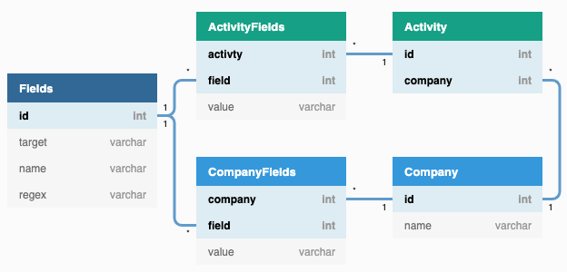

# Modello Entità-Relazione



Il database è stato progettato in modo di essere il più possibile flessibile e di poter cambiare ogni singolo campo a proprio piacimento, mantenendo però l'integrità semantica dei dati.

Per come i dati sono interpretati dall'applicazione, consultare il [Modello Dati](./data_models.md)

# Struttura

## Company

### Modello Logico

| Campo  | Descrizione |
| ------ | ----------- |
| `id`   | Un ID associato ad ogni azienda. Servirà da chiave primaria e sarà un intero. Le aziende vengono identificate da questo ID e non dal loro nome per essere coerenti con il resto delle entità. |
| `name` | Il nome dell'azienda. È inserito nella tabella `Company` e non nella tabella `CompanyField` perché è l'unico campo obbligatorio e che non può essere nullo. |

### Modello Fisico

```SQL
CREATE TABLE Company (
  id INT NOT NULL AUTO_INCREMENT,
  name VARCHAR(255) NOT NULL,
  PRIMARY KEY(id),
  UNIQUE(name),
)
```

## CompanyField

### Modello Logico

|   Campo   | Descrizione |
| --------- | ----------- |
| `company` | L'ID dell'azienda a cui appartiene il campo. Chiave esterna a `Company(id)`. |
|  `field`  | L'ID del tipo di campo in questione. Chiave esterna a `Field(id)`.
|  `value`  | Il valore del campo. |

### Modello Fisico

```SQL
CREATE TABLE CompanyField (
  company INT NOT NULL,
  field INT NOT NULL,
  value VARCHAR(255) NOT NULL,
  PRIMARY KEY(company, field),
  FOREIGN KEY (company) REFERENCES Company(id) ON DELETE CASCADE,
  FOREIGN KEY (field) REFERENCES Field(id) ON DELETE CASCADE
)
```

## Field

Questa tabella è necessaria per garantire un'integrità semantica non presente in un database SQL. Si possono inserire nuovi campi a proprio piacimento, con una sintassi inventata, senza modificare la struttura del database. Tutti i controlli verranno fatti a livello applicativo.

Un altro motivo di questa scelta è di avere consistenza nel database: visto che le colonne sono dinamiche e potrebbero essere cambiate continuamente, modificare la struttura delle tabelle potrebbe rivelarsi scomodo. Lo svantaggio di questo sistema è che, per applicare più di un filtro, sono necessarie più `JOIN`, ma visto che il database da gestire non è molto grande lo si può permettere.

### Modello Logico

|  Campo   | Descrizione |
| -------- | ----------- |
| `id`     | Un ID numerico associato ad ogni campo. |
| `name`   | Il nome del campo. |
| `regex`  | La sintassi che un valore di questo campo deve seguire per essere considerato valido. |

### Modello Fisico

```SQL
CREATE TABLE Field (
  id INT NOT NULL AUTO_INCREMENT,
  name VARCHAR(255) NOT NULL,
  regex VARCHAR(255) NOT NULL,
  PRIMARY KEY(id),
  UNIQUE(name)
)
```

## Saved

### Modello Logico

|   Campo   | Descrizione |
| --------- | ----------- |
| `student` | Lo studente che si è salvato l'azienda. Corrisponde con l'ID utente di Spaggiari. |
| `company` | L'azienda salvata. |

### Modello Fisico

```SQL
CREATE TABLE Saved (
  student INT NOT NULL,
  company INT NOT NULL,
  PRIMARY KEY (student, company),
  FOREIGN KEY (company) REFERENCES Company(id) ON DELETE CASCADE,
  FOREIGN KEY (student) REFERENCES User(id) ON DELETE CASCADE
)
```

## User

### Modello Logico

|   Campo   | Descrizione |
| --------- | ----------- |
| `student` | Lo studente che si è salvato l'azienda. Corrisponde con l'ID utente di Spaggiari. |
| `name` | Il nome dell'utente. |
| `surname` | Il cognome dell'utente. |
| `status` | Se l'utente è studente, docente, ... |

### Modello Fisico

```SQL
CREATE TABLE User (
  id INT NOT NULL,
  name VARCHAR(128) NOT NULL,
  surname VARCHAR(128) NOT NULL,
  status VARCHAR(32) NOT NULL,
  PRIMARY KEY (id)
)
```

## Privilege

### Modello Logico

| Campo  | Descrizione |
| ------ | ----------- |
| `id`   | L'ID dell'utente. Corrisponde con l'ID utente di Spaggiari. |
| `type` | Il tipo di permesso dato all'utente. |

### Modello Fisico

```SQL
CREATE TABLE Privilege (
  user INT NOT NULL,
  type VARCHAR(16) NOT NULL,
  PRIMARY KEY(id, type),
  FOREIGN KEY (user) REFERENCES User(id) ON DELETE CASCADE
)
```

## Internship

Per limitazioni tecniche, non si può inserire l'ID di Spaggiari nel campo `student`. Un utente che non è ma entrato nell'applicazione, e quindi dall'ID ignoto, potrebbe comunque essere uno stagista.

### Modello Logico

|   Campo    | Descrizione |
| ---------- | ----------- |
| `student`  | Lo studente che sta svolgendo l'attività. |
| `activity` | L'attività svolta dall'utente. |
| `company` | L'azienda che ospita lo studente. |
| `year` | L'anno in cui si è svolta questa attività. |

### Modello Fisico

```SQL
CREATE TABLE Internship (
  id INT NOT NULL AUTO_INCREMENT,
  student VARCHAR(255) NOT NULL,
  activity INT NOT NULL,
  company INT NOT NULL,
  year INT NOT NULL,
  PRIMARY KEY (id),
  UNIQUE (student, activity, company, year),
  FOREIGN KEY (activity) REFERENCES Activity(id) ON DELETE CASCADE,
  FOREIGN KEY (company) REFERENCES Company(id) ON DELETE CASCADE
)
```

## Activity

### Modello Logico

|   Campo   | Descrizione |
| --------- | ----------- |
| `id`      | Un ID associato ad ogni attività. |
| `name` | Il nome dell'attività. |
| `description` | La descrizione dell'attività. |

### Modello Fisico

```SQL
CREATE TABLE Activity (
  id INT NOT NULL AUTO_INCREMENT,
  name VARCHAR(255) NOT NULL,
  description VARCHAR(255) NOT NULL,
  PRIMARY KEY (id),
  UNIQUE (name)
)
```

## Tag

### Modello Logico

| Campo | Descrizione |
| ----- | ----------- |
| `company` | L'ID dell'azienda a cui è associato il tag. |
| `tag` | Il tag in sè. |

### Modello Fisico

```SQL
CREATE TABLE Tag (
  company INT NOT NULL AUTO_INCREMENT,
  tag VARCHAR(255) NOT NULL,
  FOREIGN KEY (company) REFERENCES Company(id),
  PRIMARY KEY (id, tag),
)
```
