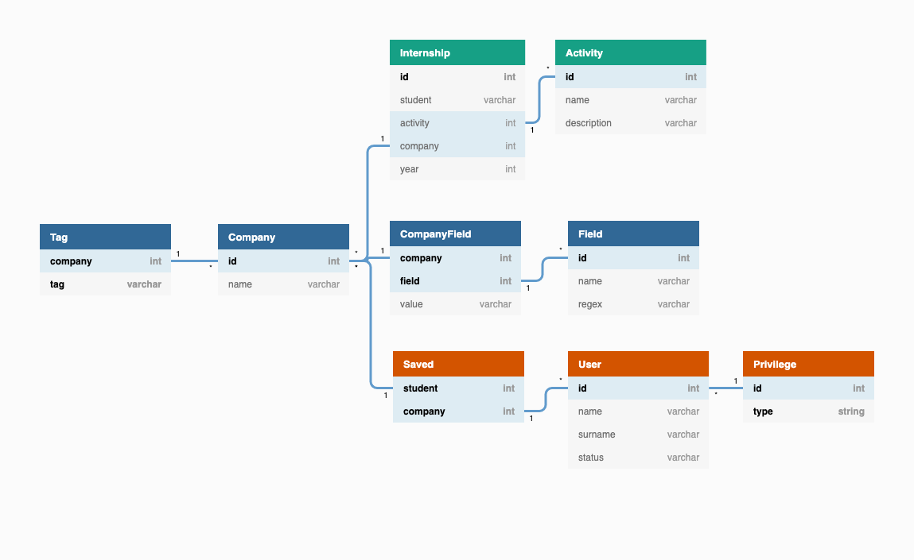

# Modello Entità-Relazione



Il database è stato progettato in modo di essere il più possibile flessibile e di poter cambiare ogni singolo campo a proprio piacimento, mantenendo però l'integrità semantica dei dati.

# Modello Logico

## Company

| Campo  | Descrizione |
| ------ | ----------- |
| `id`   | Un ID associato ad ogni azienda. Servirà da chiave primaria e sarà un intero. Le aziende vengono identificate da questo ID e non dal loro nome per essere coerenti con il resto delle entità. |
| `name` | Il nome dell'azienda. È inserito nella tabella `Company` e non nella tabella `CompanyField` perché è l'unico campo obbligatorio e che non può essere nullo. |

## Activity

|   Campo   | Descrizione |
| --------- | ----------- |
| `id`      | Un ID associato ad ogni attività. |
| `company` | L'ID dell'azienda che ha svolto questa attività. |

## Field

|  Campo   | Descrizione |
| -------- | ----------- |
| `id`     | Un ID numerico associato ad ogni campo. |
| `target` | Indica a chi può appartenere il campo (`Company` o `Activity`). |
| `name`   | Il nome del campo. |
| `regex`  | La sintassi che un valore di questo campo deve seguire per essere considerato valido. |

Questa tabella è necessaria per garantire un'integrità semantica non presente in un database SQL. Si possono inserire nuovi campi a proprio piacimento, con una sintassi inventata, senza modificare la struttura del database. Tutti i controlli verranno fatti a livello applicativo.

## CompanyField

|   Campo   | Descrizione |
| --------- | ----------- |
| `company` | L'ID dell'azienda a cui appartiene il campo. Chiave esterna a `Company(id)`. |
|  `field`  | L'ID del tipo di campo in questione. Chiave esterna a `Field(id)`.
|  `value`  | Il valore del campo. |

## ActivityField

|   Campo   | Descrizione |
| --------- | ----------- |
| `activity` | L'ID dell'attività a cui appartiene il campo. Chiave esterna a `Activity(id)`. |
|  `field`  | L'ID del tipo di campo in questione. Chiave esterna a `Field(id)`.
|  `value`  | Il valore del campo. |

# Modello Fisico

## Company
```SQL
CREATE TABLE Company (
  id INT AUTO_INCREMENT,
  name VARCHAR(128),
  PRIMARY KEY(id)
)
```

## Activity
```SQL
CREATE TABLE Activity (
  id INT AUTO_INCREMENT,
  company INT,
  value VARCHAR(128),
  PRIMARY KEY(id),
  FOREIGN KEY (company) REFERENCES Company(id)
)
```

## Field
```SQL
CREATE TABLE Field (
  id INT AUTO_INCREMENT,
  target VARCHAR(128),
  name VARCHAR(128),
  regex VARCHAR(256),
  PRIMARY KEY(id)
)
```

## CompanyField
```SQL
CREATE TABLE CompanyField (
  company INT,
  field INT,
  value VARCHAR(128),
  PRIMARY KEY(company, field),
  FOREIGN KEY (company) REFERENCES Company(id),
  FOREIGN KEY (field) REFERENCES Field(id)
)
```

## ActivityField
```SQL
CREATE TABLE ActivityField (
  activity INT,
  field INT,
  value VARCHAR(128),
  PRIMARY KEY(activity, field),
  FOREIGN KEY (activity) REFERENCES Activity(id),
  FOREIGN KEY (field) REFERENCES Field(id)
)
```
